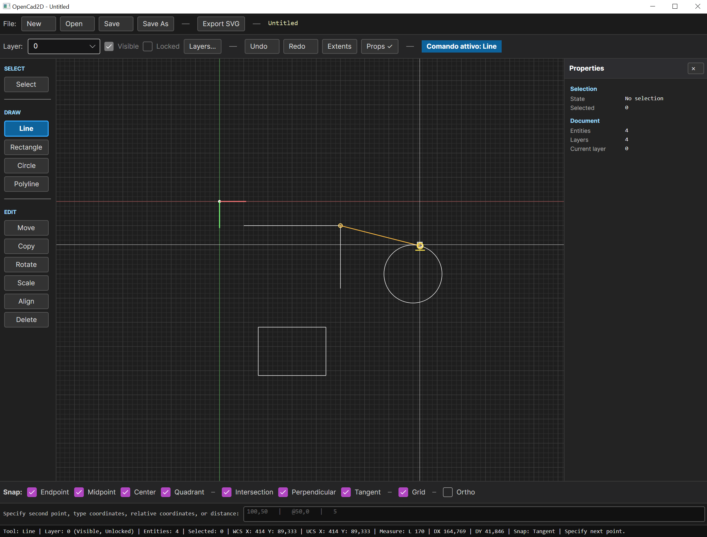

# OpenCad2D

**OpenCad2D** is an experimental open-source 2D CAD application built with **C#**, **.NET 8** and **Avalonia UI**.

The project explores how to build a small but serious 2D CAD system from the ground up, with a clean separation between geometry, document modeling, interaction logic, tools, persistence, export and the graphical user interface.

OpenCad2D is not intended to replace mature CAD applications yet. The current goal is to create a precise, fast, testable and understandable 2D CAD foundation.



## A long-running personal project

OpenCad2D is not a disposable AI-generated experiment. Its roots go back more than twenty years, to when I first started writing C# and imagining how a personal 2D CAD system could be built from the ground up.

For a long time, the project existed as separate pieces: geometry experiments, drawing ideas, editing tools, file-format tests, interface prototypes and many small lessons accumulated over years of programming. What changed recently is that AI-assisted development finally made it possible to bring those fragments together, review them, refactor them and turn them into a coherent, tested and working application.

AI is part of the process, but it is not the author of the vision. OpenCad2D remains a human-led project: shaped by long-term interest in CAD, by practical software design choices, by tests, by manual validation and by a clear preference for a precise, understandable and open 2D drafting tool.


---

## Current status

OpenCad2D currently supports a complete early CAD workflow:

- clean startup from `Templates/default.opencad2d.json`;
- maximized main window on startup;
- native save/load using `.opencad2d.json`;
- document-level settings persistence for grid, snap, ortho, polar tracking and current drawing settings;
- local application settings for last opened file metadata, recent files and last open/save/export folders;
- document recovery for partially invalid native files;
- New, Open, Save and Save As;
- SVG, DXF and PDF export, including DXF SPLINE knot-vector output and MTEXT reference width;
- ASCII DXF import for core 2D entities, layer tables, MTEXT, LWPOLYLINE bulge arcs, ELLIPSE and readable SPLINE entities;
- layers with visibility and locking;
- reusable line formats with color, lineweight, line style and custom dash pattern values;
- reusable text formats;
- reusable drawing library snippets loaded from `library/**/*.opencad2d.json`, grouped by category, previewed and inserted as block references, with a first static content pack under `library/`;
- Blocks v2 manager slices: direct/nested/total reference counts, selected diagnostics, missing-reference diagnostics, recursive-reference blocking, safe duplicate/delete/purge and hardened Edit Block session scope;
- external PNG/JPG/JPEG image references stored as linked files, not embedded raster bytes;
- relative image paths, transparency percentages, missing-image warnings, relink/replace/reset-aspect workflows, Collect Refs packaging and Image References Manager;
- Layer Manager, Line Format Manager, Text Format Manager and Image References Manager;
- compact ColorPicker support in line/text format managers;
- editable Property Panel for supported entities, including MTEXT value/reference-width editing and read-only draw order display;
- independent draw order / Z-order, separate from layers;
- CAD-style command input with a dynamic cursor-adjacent command HUD, contextual prompts, editable numeric fields, command aliases, coordinates, relative coordinates, polar input, direct distances, command history navigation and first-pass autocomplete; the old fixed bottom command row has been removed;
- object snapping, grid snapping, Ortho mode and Polar Tracking;
- selection, Select All, Select Last and Deselect;
- drawing tools for points, single-line text, multiline text, lines, rectangles, circles, ellipses, arcs, polylines, polygons and Bezier splines;
- dimension tools for horizontal, vertical, aligned, radius, diameter and angular dimensions, with stale-state marking after geometry modifications;
- transform tools: move, copy, rotate, scale and point-based align;
- modify tools: delete, break point, break segment, trim, extend, offset, fillet, explode and join;
- trim and break support based on native curve parameters for lines, arcs, circles where applicable, ellipses, elliptical arcs, polylines, polygons and open Bezier splines;
- offset for lines, circles, arcs and straight-segment polylines;
- line-line fillet with radius option, live preview, Trim/NoTrim modes and radius `0` sharp-corner join in Trim mode;
- align object tools: left, right, top and bottom;
- distribute object tools: horizontal and vertical distribution by centers;
- measure tools for distance, entity properties, angles and closed-polyline areas;
- Zoom Window, Zoom Extents, pan and reset view;
- CAD-style crosshair cursor;
- undo/redo for document mutations;
- tool-provided preview descriptor/entity protocols that keep active tool preview logic out of the app renderer;
- minimal application logging for tool/UI exceptions.

See `docs/roadmap.md`, `docs/roadmap-v0.8.100.md` and the milestone specifications in `docs/specs/` for the reconciled active v0.8 development plan. The planning specification pass now defines shared contracts for anchors, leaders/arrows, preview/commit/grouped undo and wall masks. The v0.9 stabilization gate is deferred until the v0.8.160+ Library, compatibility and manual validation pass is complete.

---

## User interface

The UI is organized into stable zones:

```text
File command bar     New / Open / Save / Save As / export buttons / file name / dirty marker
Top CAD bar          layer selector, layer state, managers, grid, polar tracking, undo/redo, view commands
Left tool panel      Select, Draw, Dimension, Measure, Edit, Order, Align/Distribute and Navigate groups
Center canvas        drawing area with CAD crosshair and previews
Right panel          editable Property Panel
Bottom snap bar      snap toggles and drafting toggles
Command HUD          cursor-adjacent active tool, contextual prompt, options and editable numeric fields
Status bar           coordinates, snap state, measurements, rendered count and messages
```

The former bottom command row has been replaced by a dynamic cursor-adjacent command HUD. Command aliases, option shortcuts and numeric point entry remain available through the HUD/internal keyboard buffer.

---

## Command input

OpenCad2D includes a CAD-style guided command input.

Examples:

```text
L
100,100
@100,0
```

```text
PL
0,0
@100,0
@100<90
C
```

Supported input forms:

| Input | Meaning |
|---|---|
| `100,50` | absolute point |
| `@50,0` | relative cartesian point |
| `@100<45` | relative polar point |
| `25` | distance, angle or factor when the active command expects it |
| `C`, `Close`, `U`, `Undo`, `All`, `Radius` | command options when exposed by the active prompt |
| empty Enter while idle | repeat the last valid command |
| empty Enter/right-click inside a command | confirm only if the current phase accepts confirmation |
| `↑` / `↓` | navigate command history while the command input is focused |
| `Tab` | accept the first autocomplete suggestion for known commands/aliases |

Mouse input and typed input feed the same tool state machine. When a tool asks for a point, the user can either click on the canvas or type coordinates.

---

## Native file format

OpenCad2D saves native drawings as:

```text
.opencad2d.json
```

The native file stores:

- entities;
- layers;
- line formats;
- text formats;
- dimension styles;
- external image reference paths, oriented rectangle geometry and opacity;
- viewport state;
- document-level settings such as grid, snap, ortho and polar tracking.

The native format is for OpenCad2D save/reopen reliability. Use DXF/SVG/PDF for interchange/export.

---

## Build and test

```bash
dotnet build OpenCad2D.sln
dotnet test OpenCad2D.sln --no-build
```

Or use the repository workflow:

```bash
make check
```

---

## Documentation

Important documents:

| Document | Purpose |
|---|---|
| `docs/architecture.md` | project structure and dependency rules |
| `docs/roadmap.md` | current roadmap, completed stabilization work and next milestones |
| `docs/roadmap-v0.8.100.md` | extended v0.8.100+ roadmap before the next stabilization gate |
| `docs/specs/` | detailed specifications and shared contracts for import drawing, blocks, dynamic command HUD, symbols, stairs, hatch, arrays, doors/windows, annotation markers, UI customization and icon SVG workflow milestones |
| `docs/testing/dynamic-command-hud-manual-verification-2026-05-31.md` | manual verification notes for the stabilized HUD and block workflows |
| `docs/commands.md` | commands, aliases and undoable command rules |
| `docs/curve-editing.md` | Trim/Break curve-editing architecture, native precision and shared cut-point rules |
| `docs/command-input.md` | command input syntax and tool workflow |
| `docs/tools.md` | tool behavior, workflow rules and preview-provider conventions |
| `docs/library-browser.md` | reusable `.opencad2d.json` library item layout, insertion workflow and limitations |
| `docs/line-formats.md` | line format and line style pattern rules |
| `docs/application-settings.md` | document settings and local settings separation |
| `docs/draw-order.md` | Z-order behavior |
| `docs/persistence.md` | native file format, recovery rules and external image reference path rules |
| `docs/known-limitations.md` | current limitations, including raster image export parity |
| `docs/release-v0.9.md` | historical/future release notes draft for the next stabilization gate |
| `docs/release-checklist-v0.9.md` | manual release checklist for the future v0.9 stabilization gate |
| `docs/release-publish-v0.9.md` | commands and packaging notes for the future v0.9 publish workflow |
| `docs/stabilization-v0.9-plan.md` | future v0.9 release-candidate stabilization plan, deferred until v0.8.160+ consolidation is complete |
| `docs/ai-handoff.md` | current handoff for future development |

Historical milestone details are intentionally kept out of the active roadmap; use Git history and release notes for old implementation logs.


## Current limitations and planned improvements

OpenCad2D is intentionally transparent about what is already solid and what still needs refinement.

- **Polyline numeric editing**: polylines can be edited visually through canvas grips and segment bulge rows, but a dedicated vertex/segment editor would still be clearer for complex corrections.
- **Non-associative dimensions**: dimensions store their own measured points and dimension-line geometry. When the measured entity is later moved, scaled or edited, the dimension value does not update automatically. OpenCad2D can mark dimensions as potentially stale after geometry changes, but users must update or recreate them manually.
- **Boundary Fill versus HatchEntity**: Boundary Fill v2 is implemented for previewed filled-polyline creation, including curve sampling and small-gap bridging. Holes, islands, hatch patterns and associative hatch behavior remain future `HatchEntity` work.
- **External raster image export parity**: PNG/JPG/JPEG references are saved, rendered, snapped, transformed and exported to SVG as external links. DXF/PDF raster-image output is still deferred, so those exports currently omit raster content.
- **Architectural parametric objects**: straight stairs exist as persistent parametric entities. Doors and windows are planned next as parametric objects with 9-point anchor control and optional wall-line masking/opening behavior.
- **Arrays and annotations**: AutoCAD-style `ARRAYRECT`, `ARRAYPOLAR`, `ARRAYPATH`, richer arrow tools, section labels and coordinate callouts are planned but not implemented yet.
- **UI customization and icons**: the current UI is fixed. Future work will add icon-only mode, saved panel/workspace preferences and an SVG export/import workflow for replacing tool icons.


## Current stabilization checkpoint

OpenCad2D is currently in the reconciled v0.8 consolidation line. Recent completed work includes:

- Dynamic Command HUD replacing the old fixed command row;
- Import Drawing and Blocks v1;
- Library Browser for `.opencad2d.json` snippets inserted as block references, now backed by a first small static Library pack;
- parametric straight `StairEntity` with plan/side/front generated linework;
- Boundary Fill v2 with preview/confirm, curve sampling, editable Gap HUD prompt and endpoint-to-endpoint/endpoint-to-segment gap bridges;
- external raster image references with relative paths, missing-reference workflow, transparency, Collect Refs and Image References Manager;
- mixed-polyline/bulge stabilization and curve-editing fixes;
- SmartPoint Tracking foundation.

The next validation step is to run the local build/test suite and the v0.8.170C Edit Block session checklist, keeping the v0.8.170A inventory and v0.8.170B duplicate/purge checklists as regression passes, then finish the broader v0.8.162 manual compatibility pass. The next implementation milestone after validation is Blocks v2 slice 170D for Library import conflict policy, followed by doors/windows, arrays, HatchEntity, annotation markers, UI customization and SVG icon workflow.

## Info files

| Language | Files | Code | Comments | Blank | Total |
|---|---:|---:|---:|---:|---:|
| C# | 625 | 81845 | 1750 | 18257 | 101852 |
| CSS | 4 | 1138 | 18 | 40 | 1196 |
| XML/XAML | 16 | 286 | 0 | 64 | 350 |
| HTML | 2 | 2 | 0 | 0 | 2 |
| **Total** | **647** | **83271** | **1768** | **18361** | **103400** |

### Metrics

- Comment ratio: 1.71 %
- Blank ratio: 17.76 %
- Code ratio: 80.53 %
- Average lines/file: 159.81
- Largest file: E:\sviluppo\2026 OpenCad2D\src\OpenCad2D.App\ViewModels\MainWindowViewModel.cs (2246 lines)


---

## License

OpenCad2D is released under the GPL-3.0-or-later license. See `LICENSE`.

---

## Credits

Created by Emilie Rollandin.
