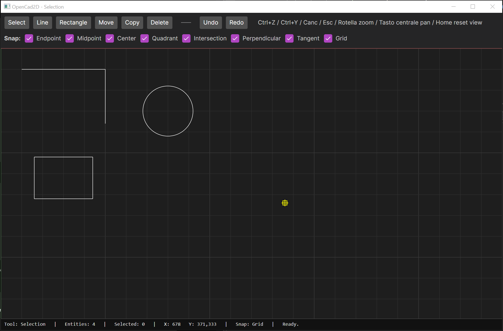

# OpenCad2D

**OpenCad2D** is an experimental open-source 2D CAD application built with **C#**, **.NET 8** and **Avalonia UI**.

The project explores how to build a small but serious 2D CAD system from the ground up, with a clean separation between geometry, document modeling, interaction logic, tools and the graphical user interface.

The long-term goal is not only to create a usable CAD application, but also to keep the codebase understandable, testable and extensible.



---

## Project status

OpenCad2D is currently an early prototype. It is **not** intended to replace mature CAD software yet.

The current focus is to build strong foundations: geometry, entities, layers, commands, undo/redo, snapping, selection, tools, coordinate systems, spatial queries, CAD-style numeric input and a first cross-platform UI.

The application already supports a basic but functional CAD workflow:

- drawing lines;
- drawing rectangles;
- drawing circles;
- selecting entities by point, window and crossing selection;
- moving, copying and deleting selected entities;
- undo and redo;
- object snapping;
- grid display and grid snapping;
- layer visibility;
- locked layer behavior;
- command line coordinate input;
- direct distance entry;
- Ortho mode;
- zoom, pan, view reset and Zoom Extents;
- CAD-style crosshair cursor;
- visual feedback for the active command, current layer, snap type and temporary measurements.

---

## What OpenCad2D can do today

The current prototype includes a tested CAD core and a first Avalonia desktop application.

The geometry layer contains 2D primitives such as points, vectors, line segments, lines, circles, arcs, polylines and bounding boxes. It also contains operations for distances, transformations, intersections, user coordinate systems and numeric tolerance handling.

The core document model supports CAD entities such as lines, circles, arcs and polylines. Rectangles are represented as closed polylines. Entities belong to layers and are stored inside a `CadDocument`.

Document edits are represented through commands. Adding, deleting, moving, copying, rotating, scaling, mirroring and replacing entities are handled by undoable commands. More complex future operations can be grouped through `CompositeCommand`, so operations such as trim, extend, fillet and chamfer can become a single undo step.

Interaction logic is kept outside the UI. Hit testing, selection and object snapping live in dedicated libraries and work in model coordinates. This keeps the Avalonia layer thin and makes the interaction behavior testable.

The current snapping system supports:

- endpoint;
- midpoint;
- center;
- quadrant;
- intersection;
- nearest;
- perpendicular;
- tangent;
- grid.

The canvas shows different snap markers depending on the snap kind. For example, endpoint, midpoint, center, perpendicular and tangent snaps have distinct visual symbols.

---

## User interface

The desktop application is built with **Avalonia UI**.

The UI currently includes:

- a lightweight top bar;
- a vertical left tool panel grouped by tool category;
- a layer selector;
- layer visibility and locked toggles;
- undo and redo buttons;
- an active command indicator;
- a drawing canvas;
- grid display;
- CAD-style full-canvas crosshair cursor;
- a bottom snap bar;
- a fixed command line input box;
- a status bar with coordinates and temporary measurements;
- zoom, pan, view reset and Zoom Extents support.

The standard mouse cursor is hidden over the canvas and replaced by a large crosshair. A small rectangle around the intersection identifies the exact picking point.

While a two-point tool is active, the UI can show temporary construction feedback:

- the accepted base point;
- the vector line from the base point to the cursor or snap point;
- temporary preview geometry;
- `L`, `DX` and `DY` measurement values in the status bar.

---

## Command line input

OpenCad2D supports a first CAD-style command line input workflow.

While a tool is waiting for a point, the user can type directly without first focusing the command input box.

Supported formats are:

| Input | Meaning |
|---|---|
| `100,50` | absolute UCS coordinates |
| `@50,0` | relative UCS offset from the current base point |
| `5` | direct distance entry from the current base point along the cursor direction |

The command line does not create entities directly. It resolves typed input to a CAD point and forwards it to the active tool exactly like a mouse click. This keeps mouse input, coordinate input and direct distance input on the same tool pipeline.

Examples:

```text
Line -> 100,50 -> 200,50
creates a line from UCS point 100,50 to UCS point 200,50.
```

```text
Line -> 100,50 -> @50,0
creates a line from UCS point 100,50 to UCS point 150,50.
```

```text
Line -> click first point -> move cursor right -> 5
creates a line with length 5 in the indicated direction.
```

The command line works with tools that accept point input, such as Line, Rectangle, Circle, Move and Copy.

---

## Ortho mode

Ortho mode constrains two-point input to the closest horizontal or vertical direction from the current base point.

```text
if |DX| >= |DY| -> horizontal constraint
if |DY| >  |DX| -> vertical constraint
```

Ortho mode affects preview, measurement feedback and direct distance entry.

Explicit coordinate input remains exact:

```text
100,50 -> exact point
@50,0  -> exact relative offset
```

Direct distance input uses the constrained direction when Ortho is enabled:

```text
click base point -> move cursor roughly right -> type 50
creates or moves along an exact horizontal distance of 50.
```

---

## Keyboard and mouse shortcuts

| Action | Shortcut |
| --- | --- |
| Undo | `Ctrl+Z` |
| Redo | `Ctrl+Y` |
| Delete selection | `Delete` |
| Cancel current tool operation | `Esc` |
| Clear selection after cancelling tool | second `Esc` |
| Zoom | mouse wheel |
| Pan | middle mouse button |
| Zoom Extents | `Home` |

`Esc` has CAD-like behavior: the first press cancels the active operation, while a second press clears the current selection if no operation is in progress.

---

## Basic usage

To draw a line, select the `Line` tool, click the first point and then click the second point. You can also enter coordinates or a direct distance through the command line.

To draw a rectangle, select the `Rectangle` tool, click the first corner and then click the opposite corner.

To draw a circle, select the `Circle` tool, choose the center point, then choose a point on the radius or type a radius as a direct distance.

To select entities, choose the `Select` tool and click an entity. Use `Shift + click` to toggle selection. Drag from left to right for window selection or from right to left for crossing selection.

To move or copy entities, select them first, choose `Move` or `Copy`, click a base point and then click a destination point. The destination point can come from the mouse, a snap, coordinates or direct distance entry.

To delete entities, select them and press `Delete` or use the delete command.

To hide a layer, choose it from the layer selector and disable its visibility checkbox. Entities on hidden layers are not drawn, selected or used by snapping.

To lock a layer, choose it from the layer selector and enable its locked checkbox. Entities on locked layers remain visible and can still be used for snapping, but they cannot be selected, moved, deleted or transformed.

To fit the visible drawing in the canvas, use `Zoom Extents` or press `Home`. Zoom Extents considers visible entities only. Hidden layers are ignored; locked layers are included because they remain visible.

---

## Architecture

OpenCad2D is split into focused projects:

```text
src/
  OpenCad2D.Geometry/
  OpenCad2D.Core/
  OpenCad2D.Interaction/
  OpenCad2D.Tools/
  OpenCad2D.App/

tests/
  OpenCad2D.Geometry.Tests/
  OpenCad2D.Core.Tests/
  OpenCad2D.Interaction.Tests/
  OpenCad2D.Tools.Tests/
  OpenCad2D.App.Tests/
```

The dependency direction is intentional:

```text
App -> Tools -> Interaction -> Core -> Geometry
```

`OpenCad2D.Geometry` contains low-level geometric primitives, operations, transformations, tolerance handling and coordinate system support.

`OpenCad2D.Core` contains CAD entities, layers, styles, the document model, spatial indexing, commands and command history.

`OpenCad2D.Interaction` contains hit testing, selection and snapping services.

`OpenCad2D.Tools` contains UI-independent CAD tools, tool controllers, action controllers and the runtime workspace.

`OpenCad2D.App` is the Avalonia desktop application. It handles presentation, input, viewport navigation and rendering.

The main architectural rule is that CAD behavior should remain outside the UI. Avalonia should forward input and render output, not implement geometric algorithms or document-editing rules.

---

## Important design foundations

### User coordinate system

The project distinguishes between:

```text
Screen coordinates
World / model coordinates
User coordinates
```

Entities are stored in world/model coordinates. The current user coordinate system can convert between user coordinates and world coordinates. Typed coordinate input is interpreted as UCS input and converted before it reaches the active tool.

### Geometry tolerance

The geometry layer includes `GeometryTolerance`, which separates distance, angle, parameter and vector-length tolerances. This avoids relying on hard-coded floating-point comparisons in geometric algorithms.

### Spatial indexing

The document entity collection is backed by an `ISpatialIndex` abstraction. The current implementation is a simple linear index, but hit testing, selection and snapping can query spatial candidates through the document API.

This prepares the project for a future quadtree, R-tree or grid-based index without rewriting interaction algorithms.

### Document mutation boundary

`CadDocument` is the public boundary for modifying entities. Commands should call document methods such as `AddEntity`, `RemoveEntities` and `ReplaceEntities` instead of directly mutating the entity collection.

This is important for validation, spatial index updates and locked-layer rules. Entities on locked layers cannot be removed or replaced through the document mutation API.

### Composite commands

`CompositeCommand` allows several commands to be executed and undone as one user-facing operation. This prepares the command system for future CAD operations such as trim, extend, offset, fillet and chamfer.

### ToolContext organization

`ToolContext` is organized into focused sub-contexts for commands, selection, snapping, coordinates and entity creation defaults.

It also stores tool-level runtime state such as the current base point and Ortho mode. This prevents the UI from needing to inspect internal tool fields.

---

## Documentation

Technical documentation lives in the [`docs`](docs/) folder.

Recommended reading:

- [Architecture](docs/architecture.md) — project structure, dependency rules, coordinate systems, document model, command line input and UI boundaries.
- [Commands](docs/commands.md) — undo/redo, command design, `CompositeCommand` and document mutation rules.
- [Tools](docs/tools.md) — tool lifecycle, `ToolContext`, pointer input, command line input, Ortho mode and tool behavior.
- [Snapping](docs/snapping.md) — snap kinds, snap providers, search areas, priorities and visual markers.
- [Roadmap](docs/roadmap.md) — current status, next development phases and long-term direction.
- [AI Handoff Document](docs/ai-handoff.md) — for AI-assisted development and project handoff.

---

## Requirements

OpenCad2D currently targets **.NET 8**.

Check your SDK version with:

```bash
dotnet --version
```

The projects currently target:

```text
net8.0
```

---

## Build

From the repository root:

```bash
dotnet build
```

---

## Run the desktop application

```bash
dotnet run --project src/OpenCad2D.App
```

---

## Run tests

```bash
dotnet test
```

The test suite covers geometry primitives, coordinate systems, tolerance behavior, intersections, CAD entities, document behavior, spatial indexing, commands, undo/redo, composite commands, selection, snapping, tools, controllers and workspace behavior.

---

## Development principles

OpenCad2D follows a few practical rules:

- CAD logic should remain independent from Avalonia.
- Geometry should not depend on the document model or the UI.
- User-facing document changes should go through commands.
- Commands should modify the document through the `CadDocument` API.
- Tools should work in model/user coordinates, not screen pixels.
- The UI should convert input and render output, not own CAD behavior.
- The command line should resolve input to points and forward them to the active tool, not create entities directly.
- Snapping should query visible spatial candidates.
- Selection should query selectable entities, which means visible entities that are not on locked layers.
- Numeric comparisons in geometry should use `GeometryTolerance`.
- New tools should be testable without launching the desktop application.

---

## Roadmap summary

Recently completed:

1. hidden layer behavior;
2. locked layer behavior;
3. selection filtering for locked layers;
4. snap support on locked layers;
5. UI toggle for locking and unlocking the current layer;
6. vertical tool panel and lighter CAD UI layout;
7. command line input;
8. direct distance entry;
9. temporary vector and measurement feedback;
10. Ortho mode;
11. CircleTool;
12. Zoom Extents.

The next planned areas are:

1. property panel;
2. polyline tool;
3. arc tool;
4. internal JSON save/load;
5. richer layer management;
6. more modify tools such as offset, trim, extend, fillet and chamfer;
7. dimensions;
8. SVG, PDF and DXF import/export.

See the [roadmap](docs/roadmap.md) for more detail.

---

## License

OpenCad2D is released under the **GNU General Public License v3.0 or later**.

This means the software can be used, studied, modified and redistributed, but distributed modified versions must preserve the same software freedom.

See the [`LICENSE`](LICENSE) file for details.

---

## Author

Created by **Emilie Rollandin**.

GitHub: [archistico](https://github.com/archistico)
